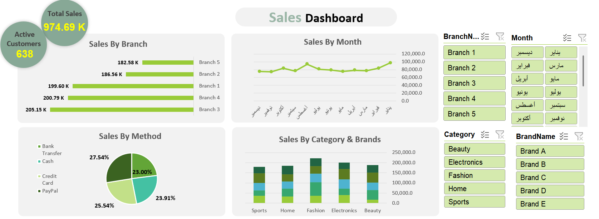

# 📊 Retail Sales Analysis | Excel Interactive Dashboard

## Overview
An interactive and dynamic Excel Dashboard designed to analyze retail sales performance, customer segments, preferred payment channels, and product categories. The dashboard provides clear visibility into key revenue drivers and payment behaviors to support business strategy.

---

## Features
* **Dynamic Sales Tracking:** Visualizing total revenue and category-level sales volumes.
* **Payment Method Insights:** Analyzing customer preferences across digital and traditional channels (Card, Cash, Instapay, Vodafone Cash).
* **Customer Segmentation:** Evaluating sales contribution across customer tiers (Gold, Silver, Bronze).
* **Top Customer Ranking:** Highlighting top-tier customers by purchasing volume.
* **Interactive Slicers:** Dynamic filtering by **Year** (2025, 2026), **Month** (1–12), and **Gender** (Male, Female).

---

## Dashboard Preview

---

## Dynamic Key Metrics
* **Total Sales Revenue:** Dynamic KPI Card tracking overall sales based on selected filters.
* **Sales & Quantity Per Category:** Home Care, Snacks, Personal Care, Beverages.
* **Preferred Payment Channels:** Evenly distributed insights across Card, Cash, Instapay, and Vodafone Cash.
* **Sales Per Customer Segment:** Bronze, Silver, and Gold tiers.

---

## Business Questions Answered
* **Which product categories generate the highest sales volume and revenue?**
* **What are the most popular payment methods used by customers (digital vs. cash)?**
* **Who are the top 5 highest-value individual customers?**
* **How does customer gender and seasonality impact monthly sales performance?**
* **Which customer segment (Gold, Silver, Bronze) contributes most to revenue?**

---

## Tools & Skills Used
* **Microsoft Excel:** Pivot Tables, Dynamic Charts, Combo Charts, Slicers.
* **Data Visualization:** Clean layout, custom color palettes, KPI card design, and UI styling.
